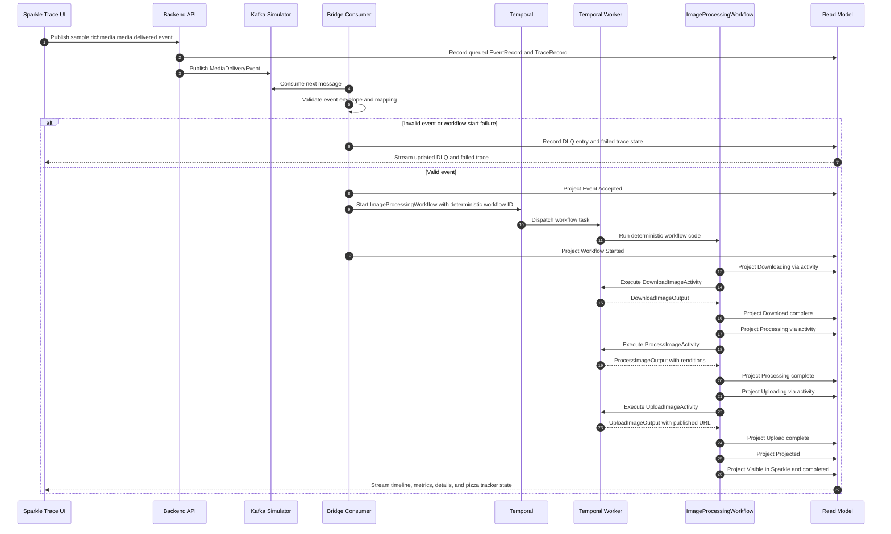

# Sparkle Trace Demo Breakdown

This document explains what the local demo shows, which source-material questions it answers, and which decisions remain open for a production migration.

## Architecture Diagram

```mermaid
flowchart LR
    Operator["Demo operator<br/>Sparkle Trace UI"] -->|"POST /api/demo/sample<br/>POST /api/demo/burst<br/>POST /api/demo/failure"| API["Go Backend API<br/>cmd/sparkle-demo"]

    API -->|"Publish MediaDeliveryEvent"| Topic["In-process Kafka simulator<br/>topic: sparkle.media.delivered"]
    Topic -->|"Consume message"| Bridge["Bridge consumer<br/>validate + map event"]

    Bridge -->|"Start ImageProcessingWorkflow<br/>WorkflowIdReusePolicy.RejectDuplicate"| Temporal["Temporal Dev Server<br/>localhost:7233"]
    Temporal -->|"Workflow and activity tasks"| Worker["Go Temporal Worker<br/>task queue: sparkle-image-processing"]

    Worker --> Workflow["ImageProcessingWorkflow"]
    Workflow -->|"Execute activity"| Download["DownloadImageActivity"]
    Workflow -->|"Execute activity"| Process["ProcessImageActivity"]
    Workflow -->|"Execute activity"| Upload["UploadImageActivity"]
    Workflow -->|"Execute activity for every trace state change"| Project["ProjectWorkflowStateActivity"]

    Download -->|"asset checksum + local URI"| Workflow
    Process -->|"rendition records"| Workflow
    Upload -->|"published URL"| Workflow
    Project -->|"upsert TraceRecord + ActivityLog"| ReadModel["File-backed read model<br/>data/read-model.json"]

    Bridge -->|"invalid event or start failure"| DLQ["DLQ records<br/>inside read model"]
    DLQ --> ReadModel

    API -->|"GET /api/snapshot"| ReadModel
    API -->|"GET /api/stream<br/>Server-Sent Events"| ReadModel
    Operator -->|"Live UI refresh"| API

    Temporal -. "debug history in Temporal Web" .-> TemporalWeb["Temporal Web UI<br/>deep execution inspection"]
```

## Workflow Diagram

## What The Demo Shows Off

**End-to-end traceability:** A sample `richmedia.media.delivered` event moves through a Kafka-like topic, bridge consumption, Temporal workflow start, workflow activities, read-model projection, and Sparkle UI rendering. The UI keeps those steps visible as one trace rather than separate logs.

**Kafka-to-workflow handoff:** The local in-process topic represents the Kafka ingestion surface. The bridge validates events, derives a deterministic workflow ID from `correlationId`, starts `ImageProcessingWorkflow`, and records duplicate starts or invalid messages without hiding them.

**Durable workflow orchestration:** Temporal owns the Rich Media pipeline: `DownloadImage`, `ProcessImage`, and `UploadImage`. The workflow uses explicit activity timeouts and retries, while side effects stay inside activities.

**Sparkle as visibility surface:** The React UI does not call Temporal directly. It reads from the backend API/read model and shows the event stream, trace timeline, details inspector, metrics, activity log, DLQ, and pizza tracker.

**Read-model projection:** Each workflow state change is projected through `ProjectWorkflowStateActivity` into `data/read-model.json`. This proves the shape of a production read path without requiring a database for the local demo.

**Failure visibility:** `Simulate failure` exercises the failed trace path, activity error capture, and visible failed state. DLQ support is included for invalid event or workflow-start failures.

## Source Questions Addressed

**Details on AITools orchestration logic:** Deferred. The demo intentionally focuses on the Rich Media “Media Delivered” workflow and leaves AITools-specific orchestration out of scope.

**Specifics of the media-delivered workflow steps:** Resolved locally as a three-activity image pipeline: download source metadata, generate rendition records, upload/publish processed outputs.

**Specific activities, inputs, and outputs:** Resolved in code through typed Go contracts for `MediaDeliveryEvent`, `ImageProcessingInput`, `DownloadImageInput/Output`, `ProcessImageInput/Output`, `UploadImageInput/Output`, `ProjectionInput`, `TraceRecord`, and `UISnapshot`.

**Kafka bridge mapping schema:** Partially resolved. The demo has one hard-coded mapping from `richmedia.media.delivered` on `sparkle.media.delivered` to `ImageProcessingWorkflow`. A production version still needs configurable topic/event/workflow mappings.

**Temporal queries for Sparkle UX:** Resolved by avoiding direct UI-to-Temporal queries. Sparkle reads the backend API/read model instead, which matches the source constraint that Sparkle should not depend on Temporal as its application database.

**Peak workflow start rate and max payload size:** Resolved for the demo only. The local demo assumes low interactive rates and metadata-only payloads with URLs, not image bytes. Production sizing remains open.

**Persistent read-model database:** Resolved locally as JSON file persistence. The production database choice remains open, but the API and UI are already shaped around a replaceable read-model boundary.

**Determinism concern from review:** Resolved. Workflow code never writes directly to files, databases, network services, or the UI. Projection happens through an activity.

## Local Decisions

- Local Kafka fidelity uses an in-process topic simulator to keep setup lightweight.
- Workflow IDs are deterministic: `sparkle-image-processing-{correlationId}`.
- Sparkle reads through `/api/snapshot` and `/api/stream`.
- The UI updates live through Server-Sent Events.
- Read-model persistence is `data/read-model.json`.
- Continue-As-New is not used because the workflow is short-lived and bounded.

## Production Follow-Ups

- Replace the in-process topic with Kafka or Redpanda and define topic names, partition keys, consumer groups, schema ownership, and replay behavior.
- Replace JSON persistence with the production read-model store and retention policy.
- Define real Rich Media activity boundaries for Showcase, SkyTour, Autoflow, Image Enhancement, or AITools if they enter scope.
- Define worker deployment topology, task queue isolation, workflow versioning, and canary rollout policy.
- Set production SLOs for workflow start rate, topic backlog, projection lag, UI query load, and DLQ handling.
